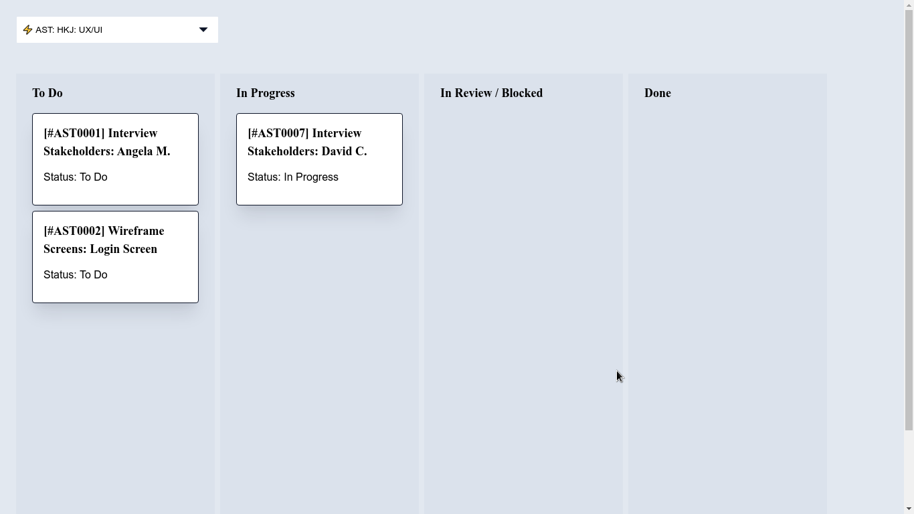

<h1 align="center"> Build Tasklight MVP: Kanban Boards</h1>

<div align="center">
  <h3>
    <a href="https://github.com/wearelighthouse/kanban-mvp">
      Source
    </a>
    <span> | </span>
    <a href="https://lh-kanban-mvp.netlify.app/">
      Demo
    </a>
  </h3>
</div>

A kanban boards which dispalys tasks within a budget.

## Overview



### Build with

- [React](https://reactjs.org/)
- [Styled Components](https://styled-components.com/docs)
- [React Beautiful DND](https://openbase.com/js/react-beautiful-dnd)

## Functionality

- Using Custom Hooks and Context API for state management.
- Display tasks in columns based on Status field.
- Allow user to Drag Tasks from one column to another.
- Show one Budget per board by filtering Tasks by Budget.
- Dropping a Task on a column updates the Status.


## Installation (for local development)

[Node.js & NPM](https://nodejs.org/en/);

```bash
# Clone this repository
$ git clone https://github.com/wearelighthouse/kanban-mvp.git

# Install dependencies
$ npm install

# Run the app
$ npm start
```

## Figma

Here is [Figma](https://www.figma.com/file/YwVQgjSLmjFb4kMaZoVRmh/Wireframes?node-id=3%3A315) link.
